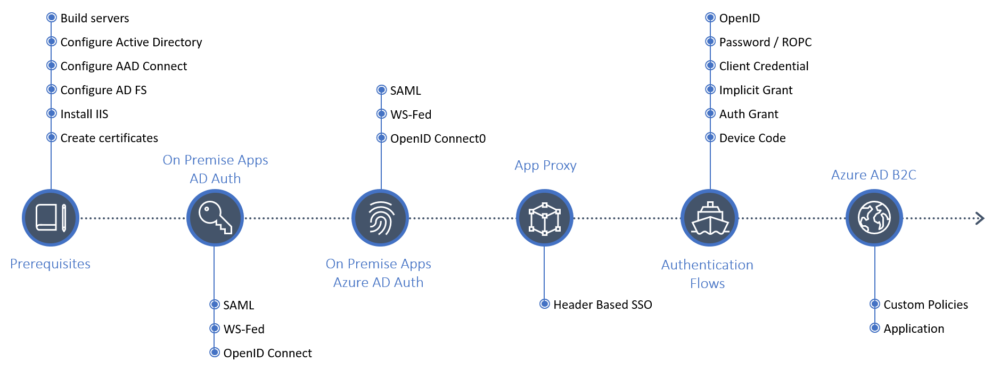
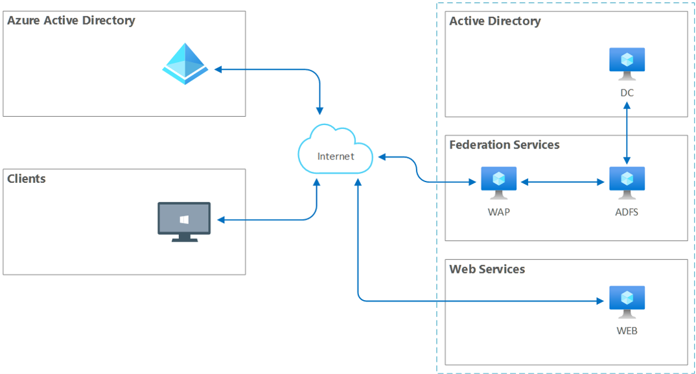

# An Authentication Lab
Let's start with an on-premises environment that synchronises accounts to Azure Active Directory. We will add some applications that authenticate against Active Directory using AD FS - SAML, WSFed and OpenID protocols.

Our lab looks a little like this and will grow as we add capabilities.

## Order of Lab Components

## Overview of Lab environment

### Prerequisits
Begin by completing the prerequisites to get our base environment setup
- 4x Virtual machines
- Domain Name
- SSL certificate 
- Azure AD tenant
- External DNS

### Build Your Environment
1. Azure Active Directory Connect
2. On-Premise applications - Using SAML, WSFED and OpenID with ADFS
3. On-Premise applications - Using SAML, WSFED and OpenID with Azure AD
4. On-Premise applications - Proxy an application using App Proxy and use Header Based SSO
5. Authentication flows - OAuth and OpenID
    - OpenID
    - Password / ROPC
    - Client Credential
    - Implicit Grant Flow
    - Auth Grant Flow
6. B2C
    - Custom Policies

## Our Test Users
